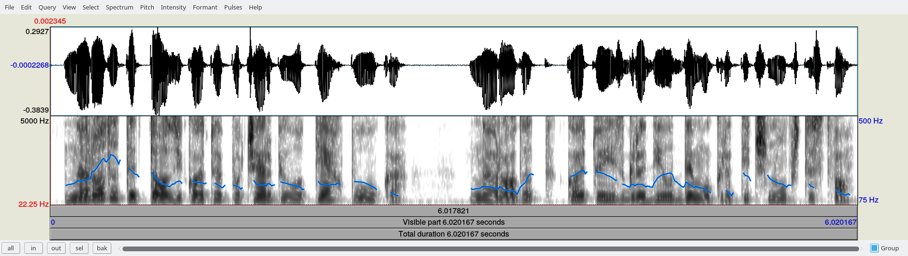
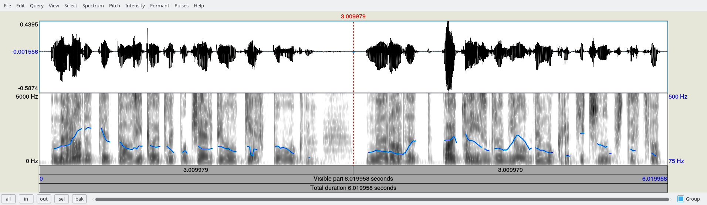
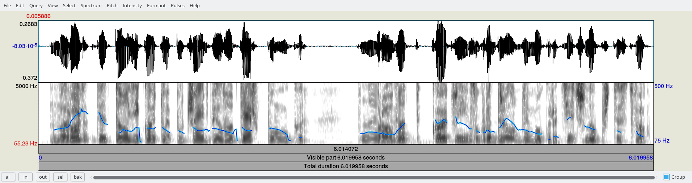
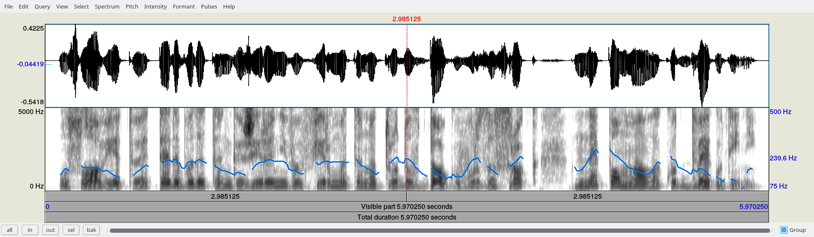
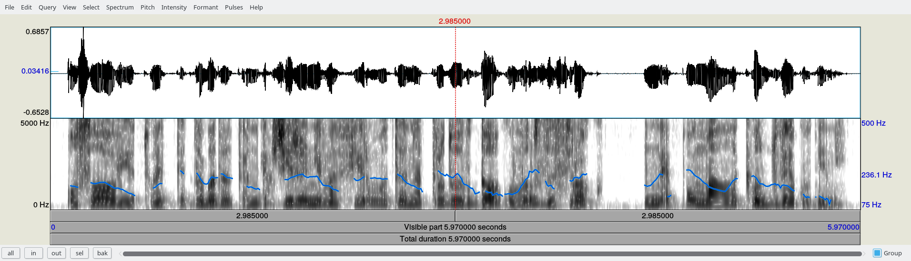
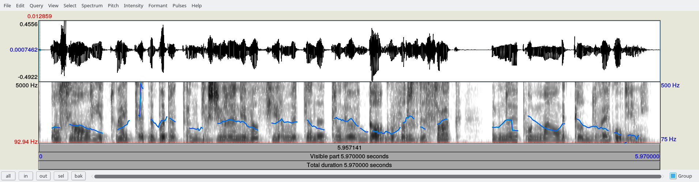
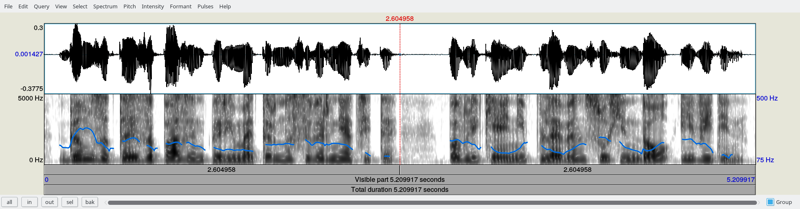
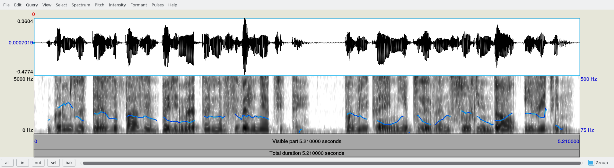
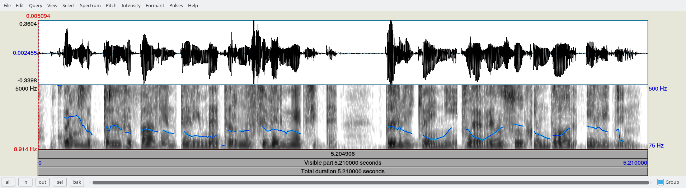

## Примери

|Пример|Продължителност|LogSpectrum|LogSpectrumCritical|SegSNR|MFCC|WSS|
|---|---|---|---|---|---|---|
|Baseline Eval 4|5.21|978.743|25.5135|0.0215048|22.9036|40.1018|
|Eval 4|5.21|867.163|22.6445|0.0215087|21.5283|32.9662|
|Baseline Test 3|6.01996|998.104|26.5848|0.0219039|22.4417|45.4586|
|Test 3|6.01996|911.935|24.7414|0.0216134|20.0368|40.9255|
|Baseline Test 7|5.97|952.45|26.9101|0.0212808|20.2043|46.0288|
|Test 7|5.97|968.124|28.3772|0.021552|20.2606|39.292|

# Пример Test 3
## Оригинален сигнал

## Ресинтезиран сигнал

## База за сравнение

# Пример Test 7
## Оригинален сигнал

## Ресинтезиран сигнал

## База за сравнение

# Пример Eval 4
## Оригинален сигнал

## Ресинтезиран сигнал

## База за сравнение

